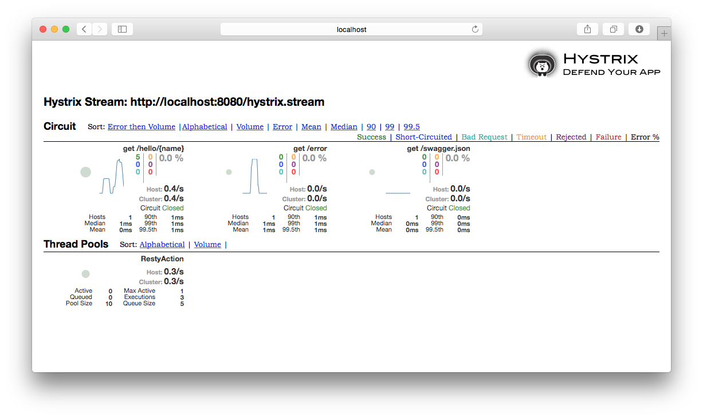

Resty [](https://travis-ci.org/takezoe/resty)
========

Super easy REST API framework for Scala

You can run the sample project by hitting following commands:

```
$ git clone https://github.com/takezoe/resty-sample.git
$ cd resty-sample/
$ sbt ~jetty:start
```

Check APIs via Swagger UI at: `http://localhost:8080/swagger-ui/`.

## Getting started

This is a simplest controller example:

```scala
import com.github.takezoe.resty._

class HelloController {
  @Action(method = "GET", path = "/hello/{name}")
  def hello(name: String): Message = {
    Message(s"Hello ${name}!")
  }
}

case class Message(message: String)
```

Define a web listener that registers your controller.

```scala
@WebListener
class InitializeListener extends ServletContextListener {
  override def contextDestroyed(sce: ServletContextEvent): Unit = {
  }
  override def contextInitialized(sce: ServletContextEvent): Unit = {
    Resty.register(new HelloController())
  }
}
```

Let's test this controller.

```
$ curl -XGET http://localhost:8080/hello/resty
{"message": "Hello resty!" }
```

## Annotations

Resty provides some annotations including `@Action`.

### @Controller

You can add `@Controller` to the controller class to define the controller name and description. They are applied to Swagger JSON.

|parameter   |required |description                   |
|------------|---------|------------------------------|
|name        |optional |name of the controller        |
|description |optional |description of the controller |

```scala
@Controller(name = "hello", description = "HelloWorld API")
class HelloController {
  ...
}
```

### @Action

We already looked `@Action` to annotate the action method. It has some more parameters to add more information about the action.

|parameter   |required |description                                          |
|------------|---------|-----------------------------------------------------|
|method      |required |GET, POST, PUT or DELETE                             |
|path        |required |path of the action (`{name}` defines path parameter) |
|description |optional |description of the method                            |
|deprecated  |optional |if true then deprecated (default is false)           |

```scala
class HelloController {
  @Action(method = "GET", path = "/v1/hello", 
    description = "Old version of HelloWorld API", deprecated = true)
  def hello() = {
    ...
  }
}
```

### @Param

`@Param` is added to the arguments of the action method to define advanced parameter binding.

|parameter   |required |description                                          |
|------------|---------|-----------------------------------------------------|
|from        |optional |query, path, header or body                          |
|name        |optional |parameter or header name (default is arg name)       |
|description |optional |description of the parameter                         |

```scala
class HelloController {
  @Action(method = "GET", path = "/hello")
  def hello(
    @Param(from = "query", name = "user-name") userName: String,
    @Param(from = "header", name = "User-Agent") userAgent: String
  ) = {
    ...
  }
}
```

## Types

Resty supports following types as the parameter argument:

- `Unit`
- `String`
- `Int`
- `Long`
- `Boolean`
- `Option[T]`
- `Seq[T]`
- `Array[T]`
- `Array[Byte]` (for Base64 encoded string)
- `AnyRef` (for JSON in the request body)

Also following types are supported as the return value of the action method:

- `String` is responded as `text/plain; charset=UTF-8`
- `Array[Byte]`, `InputStream`, `java.io.File` are responded as `application/octet-stream`
- `AnyRef` is responded as `application/json`
- `ActionResult[_]` is responded as specified status, headers and body

## Servlet API

You can access Servlet API by mix-in `ServletAPI` trait into controller. `HttpServletRequest` is available as `request` and `HttpServletResponse` is available as `response`.

```scala
class HelloController extends ServletAPI {
  @Action(method = "GET", path = "/hello")
  def hello(): Message = {
    val name = request.getParameter("name")
    Message(s"Hello ${name}!")
  }
}
```

## Validation

It's possible to validate JSON properties by asserting properties in the constructor of the mapped case class.

```scala
case class Message(message: String){
  assert(message.length < 10, "message must be less than 10 charactors.")
}
```

When the parameter value is invalid, Resty responds the following response with the `400 BadRequest` status:

```javascript
{
  "errors": [
    "message must be less than 10 charactors."
  ]
}
```

## Swagger integration

Resty provides Swagger integration in default. Swagger JSON is provided at `http://localhost:8080/swagger.json` and also Swagger UI is available at `http://localhost:8080/swagger-ui/`.


Add following parameter to `web.xml` to enable Swagger integration:

```xml
<context-param>
  <param-name>resty.swagger</param-name>
  <param-value>enable</param-value>
</context-param>
```

## Hystrix integration

Resty also provides Hystrix integration in default. Metrics are published for each operations. The stream endpoint is available at `http://localhost:8080/hystrix.stream`. Register this endpoint to the Hystrix dashboard.



Add following parameter to `web.xml` to enable Hystrix integration:

```xml
<context-param>
  <param-name>resty.hystrix</param-name>
  <param-value>enable</param-value>
</context-param>
```

## Zipkin integration

Furthermore, Resty supports Zipkin as well. You can send execution results to the Zipkin server by enabling Zipkin support and using `HttpClientSupport` for calling other APIs.

```scala
class HelloController extends HttpClientSupport {
  @Action(method = "GET", path = "/hello/{id}")
  def hello(id: Int): Message = {
    // Call other API using methods provided by HttpClientSupport
    val user = httpGet[User](s"http://localhost:8080/user/${id}")
    Message(s"Hello ${user.name}!")
  }
}
```

Add following parameters to `web.xml` to enable Zipkin integration:

```xml
<context-param>
  <param-name>resty.zipkin</param-name>
  <param-value>enable</param-value>
</context-param>
<context-param>
  <param-name>resty.zipkin.sample.rate</param-name>
  <param-value>1.0</param-value>
</context-param>
<context-param>
  <param-name>resty.zipkin.server.url</param-name>
  <param-value>http://127.0.0.1:9411/api/v1/spans</param-value>
</context-param>
```

## Log console

Resty provides a log console at `http://localhost:8080/logger-ui/`. You can change log level of LogBack loggers dynamically, download log files and tail log file on this console.


Add a following parameter to `web.xml` to enable dynamic LogBack configuration:

```xml
<context-param>
  <param-name>resty.logconsole</param-name>
  <param-value>enable</param-value>
</context-param>
<context-param>
  <param-name>resty.logconsole.dir</param-name>
  <param-value>logs</param-value>
</context-param>
<context-param>
  <param-name>resty.logconsole.file</param-name>
  <param-value>application.log</param-value>
</context-param>
```
